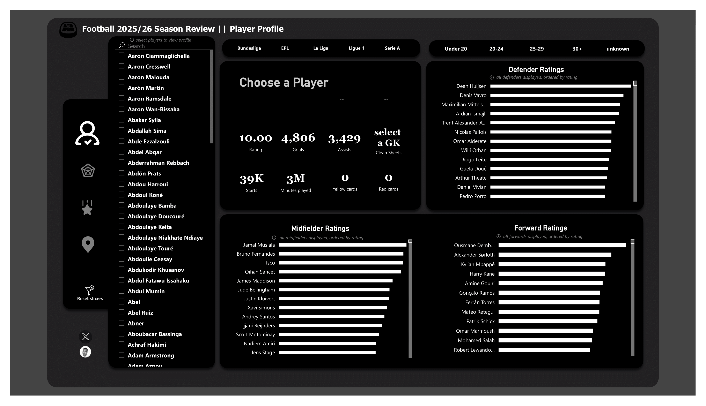
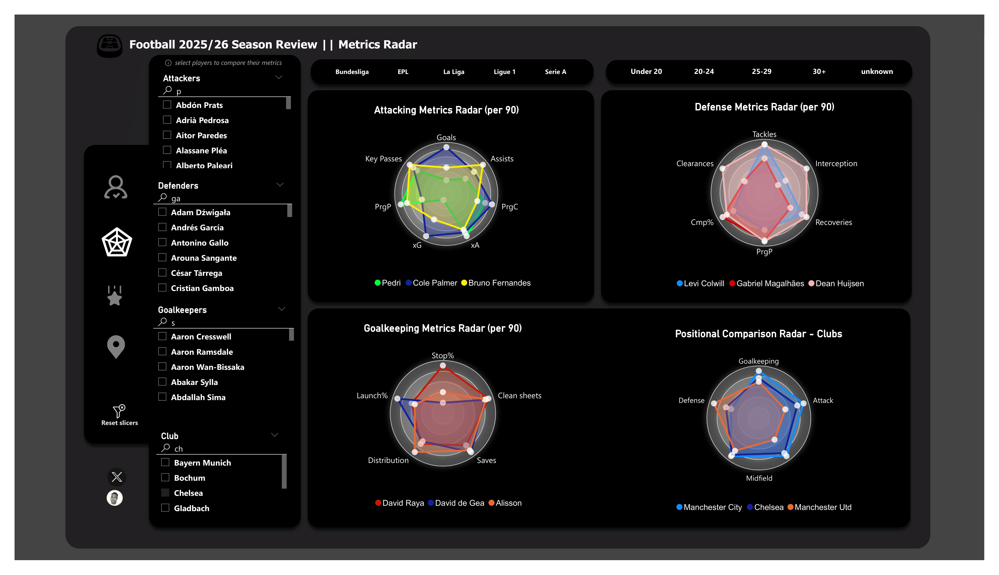
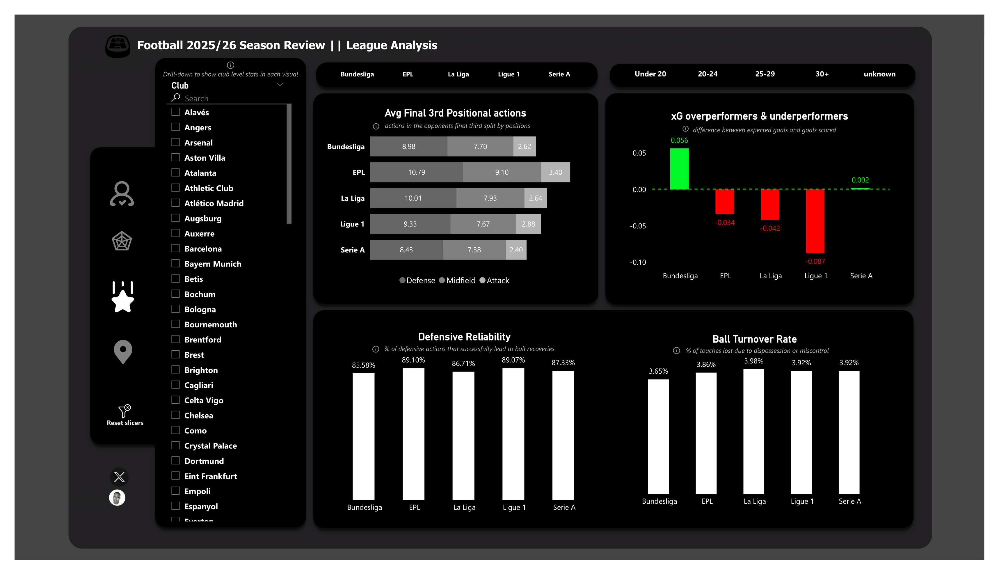
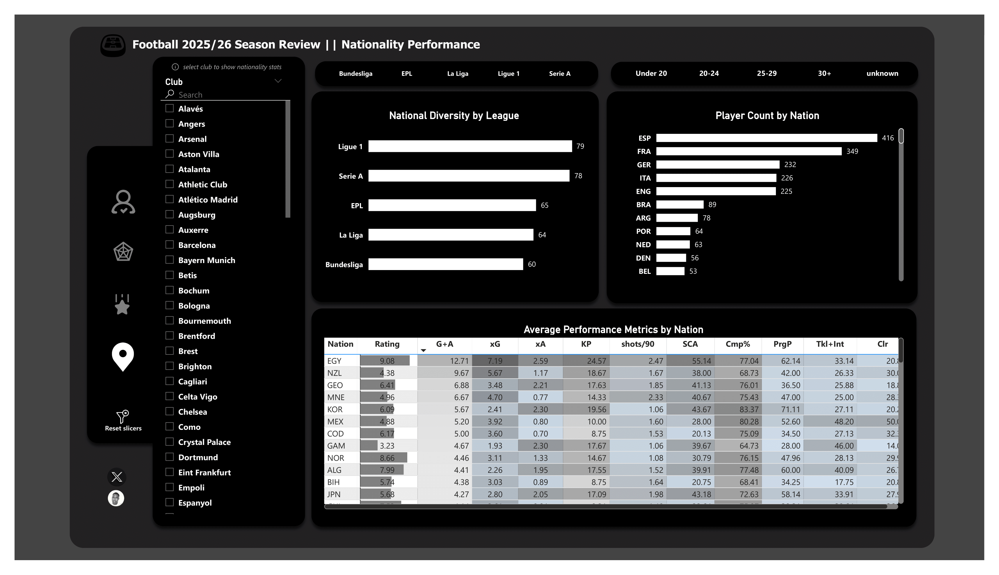

# ⚽ 2024/25 Football Stats Review — Europe’s Top 5 Leagues

A data-driven review of the 2024/25 season across Europe’s Top 5 leagues — exploring player stats, team performance, and tactical trends using SQL, Power Query &amp; Power BI.

---

## 📖 Project Overview

This project provides an analytical review of the 2024/25 football season across Europe’s Top 5 leagues — Premier League, La Liga, Bundesliga, Serie A, and Ligue 1.
The aim is to evaluate player and team performance using advanced statistics, data modelling, and interactive Power BI dashboards.

Read full breakdown here 👉  [Medium Article](https://obajimiaduraa.medium.com/summary-ab7e5dffdfb9)

---

## 🔧 Tools & Technologies

- MySQL → Data cleaning, splits, and exploratory queries

- Power Query → Data transformation, unpivoting, and preprocessing

- Power BI → Data modelling, dashboard design and visualization

---

## 📊 Dataset

Source: [Kaggle](https://www.kaggle.com/datasets/hubertsidorowicz/football-players-stats-2024-2025) (FBref-based stats)

Size: ~2,000 rows, 250+ statistical fields

Structure:

Fact Table → Player Info (including position & age bins)

Dimension Tables → Attacking, Defensive, Passing, Possession, Goalkeeping

---

## 📌 Key Insights

- League-wide metrics on possession, passing accuracy, and defensive solidity

- Player radar charts for role-specific comparisons (attackers, defenders, goalkeepers)

- Nationality contributions showing how countries influence tactical identity

- Season-over-season view of balance across Europe’s top leagues

---

## 📂 Repository Structure

| File | Description |
|------|-------------|
| `players_data-2024_2025.csv` | Player statistics dataset (Top 5 European Leagues) |
| `images/` | Folder containing dashboard screenshots & visuals |
| `players_dataquery.sql` | SQL script for initial data queries |
| `per 90 stats revised.sql` | SQL script for per-90 mins analysis |
| `FootballSznAnalysis.pbix` | Power BI dashboard file |
| `README.md` | Project overview and documentation |
| `LICENSE` | License information |

---

## 🔗 Medium Article & Dashboard Preview 

Read the full write-up here 👉 [Medium Article](https://obajimiaduraa.medium.com/summary-ab7e5dffdfb9)

Explore the interactive dashboard 👉 [Explore Dashboard](https://app.powerbi.com/view?r=eyJrIjoiMDZmNTVmY2EtZWUwMC00N2U4LWI1OTAtM2EzN2VjZjMyNDkxIiwidCI6ImE1ODNjYzNlLTRmNDgtNDM2Ni1hMTY1LWI5Mzk5YzM0ODY0MSJ9&pageName=6274d1e560532d8b5b02) 

#### 1️⃣ Player Profile & Rating  

#### 2️⃣ Metrics Radar  

#### 3️⃣ League Stats  

#### 4️⃣ Nationality Stats  

---

## ⚡ Getting Started
1. Import the `players_data-2024_2025.csv` in MySQL.
2. Run `players_dataquery.sql` &  to clean & explore the dataset.
3. Run `per 90 stats revised.sql` to create scaled ratings and tune to your taste.  
4. Open `FootballSznAnalysis.pbix` in Power BI Desktop.  
5. Explore the visuals or connect to your own dataset.
